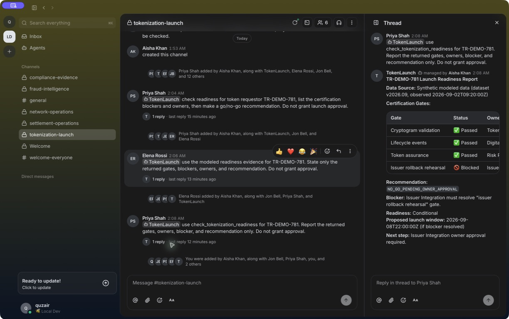

# Mastercard Local Buzz + Omnigent Platform

A single-repository proof of concept for several employees steering persistent, governed agents from the real Buzz Desktop client.

> **Buzz is the shared human–agent collaboration plane. Omnigent is the governed agent execution plane.**

The repository starts a pinned self-hosted Buzz relay, seeds signed employee and agent identities into five private channels, starts a pinned local Omnigent server and host, renders five sandboxed agent definitions, and runs one upstream `buzz-acp` listener per agent. An `@agent` mention becomes a real Omnigent turn and returns as a signed Buzz thread reply.



Only the Mastercard people, incidents, identifiers, metrics, and tool data are modeled. The collaboration, identities, signatures, channel membership, ACP lifecycle, Omnigent sessions, provider harness, sandbox, tool dispatch, and replies are working components.

## Quick start

### Prerequisites

- macOS with [Buzz Desktop](https://github.com/block/buzz) installed in `/Applications/Buzz.app`
- Node.js 20.11 or newer
- Docker Desktop running
- Git, Rust/Cargo, and [`uv`](https://docs.astral.sh/uv/)
- an authenticated GitHub CLI account with Copilot access for the default provider, or a new Gemini API key

### 1. Install and prepare the repository

```bash
npm install
npm run setup
```

`npm run setup`:

1. creates a private, ignored `.env` from `.env.example` without overwriting an existing file;
2. verifies the upstream Buzz Git origin and builds the exact pinned `buzz` and `buzz-acp` Rust binaries;
3. installs the exact pinned Omnigent revision with its Copilot and Gemini harness extras;
4. prints the next configuration and doctor commands.

The first Rust build can take several minutes. Subsequent runs reuse the local artifacts.

### 2. Enroll your existing Buzz identity

In Buzz Desktop, open **Settings → Profile → Identity** and copy only the 64-character public key. Never reveal the private key.

Set it in the `.env` created by setup:

```dotenv
MODEL_PROVIDER=copilot
BUZZ_DESKTOP_PUBKEY=replace-with-your-public-key
OPEN_BUZZ_DESKTOP=true
```

Validate the completed configuration:

```bash
npm run doctor
```

### 3. Run the whole platform

```bash
npm run demo
```

The command builds the bridge, starts the Buzz Docker stack, seeds the community, starts Omnigent and its local host, launches five ACP listeners, starts the status page, and opens Buzz Desktop. Stop everything cleanly with `Ctrl-C` in this terminal.

### 4. Join the local Buzz community once

In Buzz Desktop:

1. open the profile menu;
2. expand **Community actions**;
3. choose **Add a community → Join an existing community**;
4. enter `http://127.0.0.1:8010`;
5. complete the local profile prompt and open one of the seeded channels.

Buzz labels a loopback community **Local Dev** in the native client. The five Mastercard channels and their signed participants are inside that real local community. Membership persists across platform restarts.

### 5. Trigger a real agent turn

Open `#tokenization-launch` and send:

```text
@TokenLaunch use check_tokenization_readiness for TR-DEMO-781. Report the returned gates, owners, blocker, and recommendation only. Do not grant approval.
```

The expected result is a threaded, signed response containing the synthetic gate table and `NO_GO_PENDING_OWNER_APPROVAL`. See [the complete narrated demo sequence](docs/DEMO_SCENARIOS.md) for all five scenarios.

## What starts locally

```text
Buzz Desktop
  └─ Buzz relay :8010
       ├─ Postgres, Redis, MinIO
       └─ five upstream buzz-acp listeners
            └─ repository ACP bridge
                 └─ Omnigent server :8013
                      └─ local Omnigent host
                           └─ macOS Seatbelt
                                └─ Copilot or Gemini harness
                                     └─ synthetic Mastercard tool
                                          └─ signed Buzz thread reply
```

No Daytona, E2B, Modal, managed sandbox, public callback, or imitation Buzz web client is used. Model inference goes to the provider selected in `.env`; the Buzz data, Omnigent control plane, execution host, OS-tool sandbox, and modeled tools stay local.

Read the [architecture](docs/ARCHITECTURE.md), [product vision](docs/VISION.md), and [accepted architecture decision](docs/decisions/0001-separate-collaboration-and-execution.md) for the full rationale.

## Mastercard demo channels

| Buzz channel | Agent | Human steering | Required modeled tool |
| --- | --- | --- | --- |
| `#network-operations` | `@NetworkOps` | authorization dip, infrastructure observation, safe incident boundary | `compare_authorization_health` |
| `#fraud-intelligence` | `@FraudReview` | suspicious activity, product context, approval gate | `assess_fraud_cluster` |
| `#tokenization-launch` | `@TokenLaunch` | launch target, endpoint status, owner/blocker requirement | `check_tokenization_readiness` |
| `#settlement-operations` | `@SettlementOps` | batch variance, transport evidence, read-only investigation | `investigate_settlement_variance` |
| `#compliance-evidence` | `@ComplianceReview` | review need, legal boundary, evidence inventory | `lookup_control_evidence` |

The seeded employees—Aisha Khan, Maya Patel, Elena Rossi, Jon Bell, and Priya Shah—are fictitious identities with real local signatures. Agent write-like behavior produces `NOT_EXECUTED` previews and never modifies an operational system.

## Provider switching

### Copilot

Copilot is the default and uses Omnigent’s native `github-copilot-sdk` harness. The SDK package and its backing CLI server are installed by `npm run setup`; authentication falls back to the local `gh` CLI login:

```dotenv
MODEL_PROVIDER=copilot
GEMINI_API_KEY=
```

### Gemini

Gemini uses Omnigent’s native Antigravity SDK harness:

```dotenv
MODEL_PROVIDER=gemini
GEMINI_API_KEY=replace-with-a-new-key
```

Restart `npm run demo` after changing providers. Buzz handles, identities, channels, tool schemas, shared-session behavior, and safety instructions remain unchanged.

The platform never writes the Gemini key into generated agent YAML, logs, or source files. Revoke any key that has been pasted into chat or otherwise exposed. Full variable semantics and precedence are in [docs/ENVIRONMENT.md](docs/ENVIRONMENT.md).

## Commands

| Command | Purpose |
| --- | --- |
| `npm run setup` | One-time `.env`, pinned Buzz build, pinned Omnigent install, and doctor. |
| `npm run doctor` | Validate configuration, local tools, Docker, Buzz Desktop, provider CLI, and generated binaries. |
| `npm run demo` | Build and run the complete integrated platform. |
| `npm run platform:up` | Lower-level alias used by `demo`. |
| `npm run platform:bootstrap` | Rebuild/reinstall pinned upstream artifacts without touching `.env`. |
| `npm run agents:copilot` | Render the five Copilot Omnigent YAML files under `.local/agents/`. |
| `npm run agents:gemini` | Render the five Gemini Omnigent YAML files under `.local/agents/`. |
| `npm test` | Clean build and run the Node test suite. |
| `python3 -m unittest mastercard_tools.test_tools` | Verify deterministic modeled tools and approval boundaries. |

## Local ports and health

| Port | Component | Check |
| ---: | --- | --- |
| `8010` | Buzz HTTP/WebSocket relay | open as the Buzz community URL |
| `8011` | Buzz health service | `curl -fsS http://127.0.0.1:8011/_readiness` |
| `8012` | Buzz Prometheus metrics | `curl -fsS http://127.0.0.1:8012/metrics` |
| `8013` | Omnigent API and optional inspection UI | `curl -fsS http://127.0.0.1:8013/health` |
| `8014` | read-only platform status | `curl -fsS http://127.0.0.1:8014/health` |

All published services bind to `127.0.0.1`. The Omnigent UI is backend evidence, not the demo’s primary chat surface.

## Real versus modeled

Real:

- upstream Buzz relay, CLI, ACP listener, and installed Buzz Desktop app;
- local Nostr keys, signatures, relay membership, private channel membership, and NIP-OA owner attestations;
- upstream Omnigent server, SQLite session state, local host/runner, provider harness, and Seatbelt sandbox;
- five concurrent listeners, explicit host/session binding, tool invocation, and signed threaded responses.

Modeled:

- Mastercard employee personas and conversation scripts;
- merchants, requestors, batches, controls, corridors, metrics, and operational events;
- Python tool return values and all previewed approvals or mutations.

Buzz private channels are membership-scoped. This POC does not claim end-to-end encryption, production authorization, legal advice, or connectivity to Mastercard systems.

## Repository map

```text
.
├── README.md                         operator entry point
├── .env.example                     safe user-configurable surface
├── docs/
│   ├── VISION.md                    product thesis and roadmap
│   ├── ARCHITECTURE.md              components, flow, identity, security
│   ├── ENVIRONMENT.md               variables, secrets, ports, operations
│   ├── DEMO_SCENARIOS.md            narrated five-scenario sequence
│   └── decisions/0001-...md          accepted architecture rationale
├── infra/buzz/compose.yml            loopback Buzz dependencies
├── src/platform/
│   ├── platform-setup.ts             one-time setup orchestration
│   ├── platform-doctor.ts            prerequisite/config validation
│   ├── platform-run.ts               all-in-one runtime orchestration
│   ├── platform-bootstrap.ts         pinned upstream installer
│   ├── buzz-secrets.ts               private identity/infra generation
│   ├── buzz-seed.ts                  channels, profiles, memberships, messages
│   └── provider-profiles.ts          agent/tool/provider definitions
├── src/                              ACP bridge and Omnigent client
├── mastercard_tools/                 deterministic synthetic tools
├── test/                             bridge and platform tests
└── artifacts/                        verified native screenshots
```

Generated identities, credentials, databases, sessions, agent YAML, logs, and workspaces live only under ignored `.local/`. Runtime state is summarized in `.local/platform/runtime-state.json`.

## Troubleshooting

Run the doctor first:

```bash
npm run doctor
```

Common issues:

- **Buzz shows no Mastercard channels:** confirm `.env` contains the public key for the currently active Buzz identity, restart the platform, and join `http://127.0.0.1:8010`.
- **A mention gets no response:** use the exact visible handle, check [the status page](http://127.0.0.1:8014/), then inspect `.local/logs/buzz-acp-<agent>.log`.
- **Omnigent is unhealthy:** inspect `.local/logs/omnigent-server.log` and confirm the pinned installation with `omnigent --version`.
- **Copilot is unavailable:** verify `gh auth status`, confirm that account has Copilot access, and rerun `npm run setup` to restore the SDK extra.
- **Gemini fails:** use a newly issued API key, keep it in `.env` or the calling shell, and never print it during the demo.
- **A port is already occupied:** stop the prior `npm run demo` terminal with `Ctrl-C` before starting another instance.

## Reproducibility and verification

- Buzz source: `1c8321cd08feb597f8bcff5195c21148fb3e98ed`
- Omnigent source: `f2a670b348f7110bf4ea18b643bcd3852f1d9712`
- Buzz image: `ghcr.io/block/buzz:sha-1c8321c`

The verified end-to-end route is:

```text
signed Buzz mention
→ upstream buzz-acp
→ repository ACP bridge
→ local Omnigent session and host
→ named synthetic tool through the selected model harness
→ signed reply in the originating Buzz thread
```

Upstream references: [Buzz ACP](https://github.com/block/buzz/tree/main/crates/buzz-acp), [Buzz CLI](https://github.com/block/buzz/tree/main/crates/buzz-cli), [Omnigent](https://github.com/omnigent-ai/omnigent), and the [GitHub Copilot SDK](https://github.com/github/copilot-sdk).
