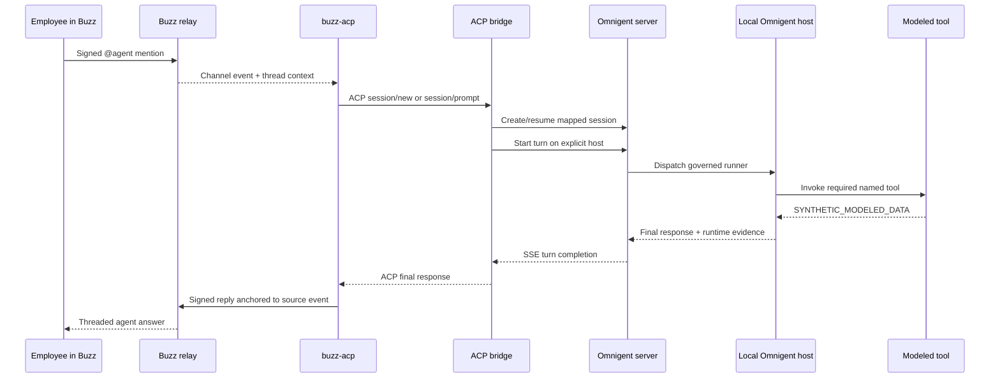

# Architecture

## System boundary

The platform deliberately separates collaboration from execution.

| Buzz owns | Gateway owns | Omnigent owns |
| --- | --- | --- |
| humans and agent identities | Buzz-to-Omnigent identity mapping | agent definitions |
| communities and membership | channel/session routing | models and harnesses |
| channels and threads | context packaging | tools and tool schemas |
| signed messages and reactions | turn serialization and correlation | sandbox and runtime policy |
| shared decision history | final-response publication | execution telemetry |

Neither Buzz nor Omnigent is patched. The integration consumes their supported relay, ACP, and HTTP/SSE contracts.

## Local topology

```text
/Applications/Buzz.app
        │ signed Nostr events
        ▼
Buzz relay :8010 ── Postgres + Redis + MinIO
        │
        ├── #network-operations ───── @NetworkOps listener
        ├── #fraud-intelligence ───── @FraudReview listener
        ├── #tokenization-launch ──── @TokenLaunch listener
        ├── #settlement-operations ── @SettlementOps listener
        └── #compliance-evidence ──── @ComplianceReview listener
                                         │ ACP over stdio
                                         ▼
                              buzz-omnigent-acp bridge
                                         │ HTTP + SSE
                                         ▼
                               Omnigent server :8013
                                         │
                               local Omnigent host
                                         │
                              macOS Seatbelt sandbox
                                         │
                              Copilot or Gemini harness
                                         │
                          mastercard_tools (synthetic data)
```

The read-only status surface on port `8014` reports relay health, Omnigent health, provider selection, listener count, and channel-to-agent bindings.

## Turn sequence



## Identity and session mapping

- Each agent has a locally generated Nostr keypair stored under ignored `.local/buzz/identities.json`.
- The community owner signs a NIP-OA attestation for each agent profile.
- Each seeded employee has a distinct signing identity.
- The real Buzz Desktop user supplies only a public key through `BUZZ_DESKTOP_PUBKEY`; the platform never reads its private key.
- `buzz-acp` uses channel-scoped session policy, so multiple allowed employees steer the same agent/channel session.
- The bridge binds each ACP session to an explicit Omnigent agent ID, host ID, and local workspace.

## Concurrency and context

Upstream `buzz-acp` owns mention detection, channel-context collection, event deduplication, and serialized session prompting. The configured policy is:

- respond only to the allowlisted employee identities;
- keep one session per agent/channel;
- steer an active turn when additional context arrives;
- include up to 12 recent context messages;
- enforce bounded idle and turn timeouts.

This preserves shared steering while preventing two uncontrolled turns from mutating the same session simultaneously.

## Runtime isolation

The Omnigent host runs on the local Mac. Agent profiles use `darwin_seatbelt`, expose no writable paths, and block network access for sandboxed OS tools. The selected model harness communicates with its model provider outside that OS-tool sandbox; this is an intentional provider boundary, not a claim that inference is local.

The Python tools contain deterministic scenario data only. They reject unknown identifiers, label every return value, and expose write-like behavior as `NOT_EXECUTED` previews requiring human approval.

## Persistence

| State | Location |
| --- | --- |
| generated Buzz identities and infra secrets | `.local/buzz/` |
| Buzz channel IDs and agent auth tags | `.local/buzz/seed-state.json` |
| Buzz messages and membership | local Docker volumes |
| Omnigent sessions | `.local/omnigent/chat.db` |
| generated agent YAML | `.local/agents/` |
| per-agent workspaces | `.local/omnigent/workspaces/` |
| service logs | `.local/logs/` |
| current process/channel map | `.local/platform/runtime-state.json` |

All of `.local/` is ignored by Git.

## Security boundary summary

- Every published service binds to loopback.
- Buzz relay membership is required; channels are membership-scoped.
- Private keys and generated infrastructure credentials are mode `0600` files under `.local/`.
- User-controlled Buzz content is treated as untrusted context by agent prompts.
- External commands use argument arrays rather than shell interpolation.
- Remote cleartext Omnigent URLs are rejected by the bridge.
- Provider secrets come from `.env` or the calling shell and are never rendered into generated agent YAML.
- This POC does not claim end-to-end encryption or production authorization controls.

## Source reproducibility

- Buzz source commit: `1c8321cd08feb597f8bcff5195c21148fb3e98ed`
- Omnigent source commit: `f2a670b348f7110bf4ea18b643bcd3852f1d9712`
- Buzz relay image: `ghcr.io/block/buzz:sha-1c8321c`

`npm run setup` verifies the Buzz Git origin, checks out the exact commit, builds locked Rust binaries, and installs Omnigent from its exact official Git revision.
